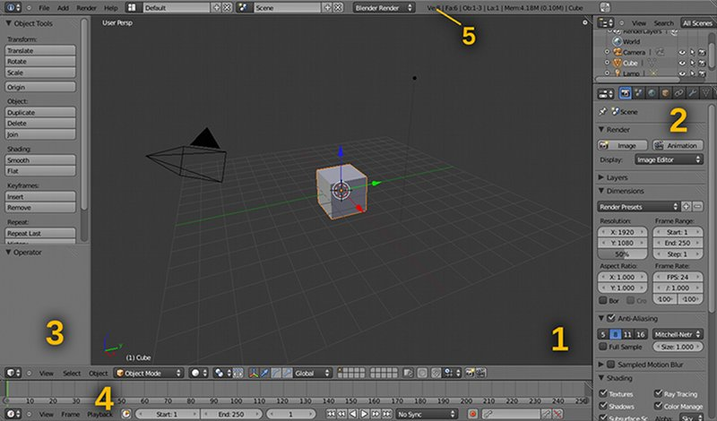

# Часть 1. Основы интерфейса
Запустив Blender, вы сразу заметите, что внешний вид программы значительно отличается от «общепринятого» 
и не вписывается в стандартное окружение операционной системы. Поэтому ознакомление с ней обычно начинается 
с освоения принципов работы графического интерфейса.

Основное окно Blender состоит из одного или более рабочих пространств – редакторов (editors), в которых 
размещаются элементы управления. Можно изменять пропорции редакторов, перетаскивая их границы нажатием 
левой кнопки мыши. Любой редактор можно разбить на две части, каждая из которых сама становится редактором, 
или, наоборот, объединить в одно целое с другим. Для этого используется значок в виде полосатого треугольника 
в правом верхнем или левом нижнем углу редактора. Если нажать на него левой кнопкой и потянуть курсор внутрь, 
редактор будет разделен на две части. Если потянуть наружу, редактор можно будет объединить с соседним: 
появится стрелка, указывающая направление объединения (рис. 1).

Рис. 1. Главное окно Blender

Редактор представляет собой способ визуализации данных проекта – это может быть проекция трехмерной сцены, 
дерево объектов, временная шкала или что-то другое. Тип редактора можно выбрать в специальном меню в левом 
нижнем или верхнем углу. В этой главе мы рассмотрим только четыре основных: это область трехмерного просмотра, 
редактор свойств, временная шкала и информационная панель. Именно их вы видите при первом запуске Blender (рис. 2).

1. Область трехмерного просмотра (3D View). В ней отображается проекция трехмерной сцены на экран. По умолчанию сцена содержит только три объекта – куб, камеру и источник света (рассмотрим их позже). Вы можете осуществлять навигацию по сцене при помощи средней кнопки мыши. Нажав ее и потянув курсор в сторону, вы повернете точку наблюдения. Если при этом удерживать клавишу Ctrl, можно приблизить или отдалить изображение. Эту же функцию выполняет поворот колесика мыши. Наконец, нажатие средней кнопки с одновременным удерживанием Shift сместит точку наблюдения в сторону.
2. Редактор свойств (Properties). В этом редакторе можно менять настройки (свойства) сцены и объектов. Этих настроек очень много, поэтому их разбили на несколько групп.  Переключаться между группами настроек можно при помощи панели со значками вверху редактора. Если эта панель не помещается целиком на экране, ее можно прокрутить колесиком или средней кнопкой мыши. По умолчанию активирована группа «Render» с настройками рендеринга сцены.
3. Панель инструментов (Tool Shelf). Это не редактор, а часть области трехмерного просмотра – но, тем не менее, очень важный элемент интерфейса. На ней расположены кнопки (операторы) доступных в текущем режиме инструментов. Панель инструментов вызывается и прячется клавишей «T».
4. Временная шкала (Timeline). Цифры на ней обозначают кадры анимации, а зеленая полоска отмечает текущий кадр (по умолчанию 1). Прокручивать шкалу можно двумя способами – либо вездесущей средней кнопкой мыши, либо перетаскивая ползунок. Колесико мыши (или средняя кнопка + Ctrl) изменяет масштаб шкалы. Текущий кадр можно изменить, кликнув на нужное деление. Кроме того, можно воспользоваться клавишами-стрелками «Вправо» (перемещение на один кадр вперед), «Влево» (на один кадр назад), «Вверх» (на 10 кадров вперед), «Вниз» (на 10 кадров назад). На временной шкале также имеются привычные кнопки воспроизведения, реверса и перехода по ключевым кадрам.
5. Информационная панель (Info). Ее часто называют главным меню, потому что по умолчанию она расположена в верхней части окна – там, где в других программах обычно бывает главное меню. Однако это тоже редактор, такой же, как и все остальные, просто свернутый в панель. Если вы потянете ее вниз, появится остальная часть редактора, которая представляет собой журнал событий Blender. В меню информационной панели можно сохранить, загрузить или начать новый проект, восстановить сессию после аварийного завершения, сбросить настройки интерфейса на «заводские», добавить новый объект, отрендерить сцену или перейти по ссылкам на полезные ресурсы по Blender в Интернете. Информационная панель предоставляет полезную возможность – сохранять текущую конфигурацию интерфейса (screen layout). Вы можете настроить интерфейс по своему вкусу и сохранить его под указанным именем, нажав клавишу « + ». 

Разработчики Blender также любезно предоставили несколько готовых конфигураций, оптимизированных под различные режимы 
работы: анимация (animation), композитинг (compositing), по умолчанию (default), игровая логика (game logics), 
скриптинг (scripting), редактирование UV-координат (UV editing) и монтаж видео (video editing). Каждая глава этой 
книги рассматривает работу в одном из этих режимов.

Рядом с меню режимов интерфейса находится меню сцен. Каждая сцена содержит свои объекты и настройки рендеринга. 
Blender позволяет работать с несколькими сценами в одном проекте – теоретически, в один проект можно вместить целый фильм! 
А во встроенном игровом движке Blender сцены играют роль отдельных уровней или локаций.

Кроме того, на информационной панели можно выбрать движок рендеринга – опытные пользователи Blender часто используют 
внешние программы для рендеринга (такие, как YafaRay, LuxRender, Aqsis, V-Ray, Indigo). Они, как правило, включают 
сложные алгоритмы и передовые методы получения фотореалистичных изображений, жертвуя при этом скоростью рендеринга, 
в то время как встроенный движок Blender представляет собой удачный компромисс между качеством результата и временем, 
затрачиваемым на его вычисление.

Сцена, которая загружается по умолчанию, уже содержит трехмерный объект – куб. Вы можете нажать F12 и отрендерить его. 
При этом процесс рендеринга будет отображаться в специальном редакторе изображений (UV/Image editor). 
Чтобы потом вернуться обратно к сцене, нажмите Escape.

Выделите куб правой кнопкой мыши и удалите его клавишей Delete (появится диалог, требующий подтверждения удаления). 
Новые объекты можно добавлять через меню Add на информационной панели. 

Это же меню, кстати, можно вызывать комбинацией Shift+A. Нас сейчас интересуют объекты в разделе Mesh. 
Это основные геометрические тела (примитивы), из которых собираются объекты более сложных форм – плоскость (plane), 
куб (cube), окружность (circle), UV-сфера (UV sphere), икосфера (icosphere), цилиндр (cylinder), конус (cone). 
UV-сфера и икосфера отличаются методом построения: UV-сфера состоит из четырехугольников, а икосфера – из треугольников.

В качестве дополнения в меню также присутствуют сетка (grid), обезьяна (monkey) и тор (torus). Сетка – это та же плоскость, 
но разбитая на отдельные квадратные ячейки.  Тор – примитив, напоминающий обруч или бублик. А обезьяна Сьюзанн (Suzanne) – 
это своего рода талисман программы. Она используется, когда надо проверить какой-нибудь эффект, а под рукой нет 
объекта подходящей сложности. Сьюзанн можно часто встретить на тестовых изображениях, демонстрирующих различные 
материалы, источники света или настройки рендеринга.

Добавьте какой-нибудь примитив, например, UV-сферу. Вы заметите, что отчетливо видны грани, составляющие поверхность сферы. Чтобы сфера выглядела сглаженной, нажмите на панели инструментов кнопку «Smooth» (соответственно, кнопка «Flat» возвращает граням резкость).

При добавлении нового объекта, он появляется строго в определенном месте, которое отмечает так называемый 3D-курсор – он выглядит как полосатая красно-белая окружность. Вы можете перемещать его в любое место нажатием левой кнопки мыши.
По умолчанию 3D-курсор находится в центре координатной системы сцены. Там же будет расположен и центр созданной сферы – вы его легко можете отличить по трем разноцветным осям. 

Эти оси называются манипулятором (или «гизмо») и позволяют трансформировать выделенный объект в пространстве. В Blender 
есть три типа манипуляторов: перемещение, поворот и масшатбирование. Манипулятор перемещения выглядит как три перпендикулярные 
стрелки, манипулятор поворота – как три кольца, а манипулятор масштабирования – как три стрелки с квадратными завершениями. 
Переключиться между типом манипулятора можно на нижней панели области трехмерного просмотра: на ней есть три кнопки 
с соответствующими пиктограммами.

Если нажать на стрелку или кольцо левой кнопкой мыши и потянуть курсор в сторону, произойдет (в зависимости от типа 
манипулятора) перемещение или масштабирование объекта вдоль соответствующей оси, либо поворот объекта вокруг 
соответствуюшего кольца.

Трансформацию объекта можно также осуществлять при помощи «горячих клавиш». Нажатие клавиши «G» активизирует режим 
перемещения объекта, «R» – поворота, «S» – масштабирования. В этом случае перемещение по умолчанию происходит в 
экранной плоскости, поворот – вокруг оси, перпендикулярной экранной плоскости, а масштабирование – относительно всех 
трех осей равномерно. Но вы можете указать ось трансформации клавишами «X», «Y» и «Z». При этом выбранная ось будет 
показана на экране в виде прямой, проходящей через центр объекта.

Полезные функции для управления трансформацией предоставляет также панель свойств в правой части области трехмерного 
просмотра, которую можно вызвать клавишей «N» (по умолчанию она скрыта). В ней можно вручную изменить точные 
координаты объекта, углы поворота, масштаб и многие другие свойства. На этой же панели имеются координаты 3D-курсора.
